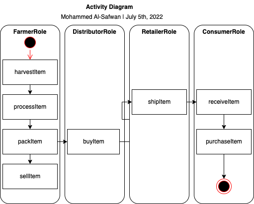
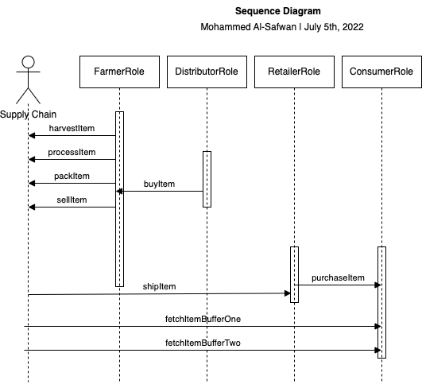
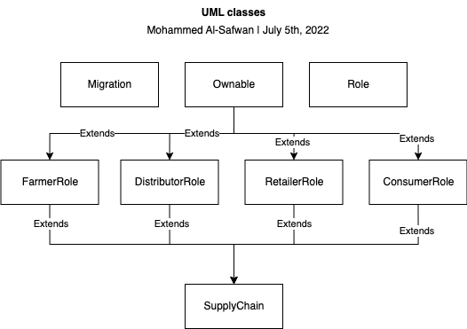
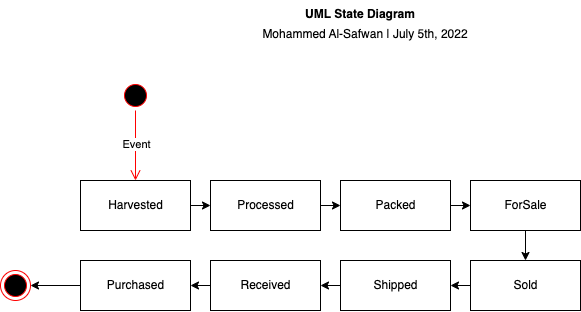

# Supply chain & data auditing

This repository containts an Ethereum DApp that demonstrates a Supply Chain flow between a Seller and Buyer. The user story is similar to any commonly used supply chain process. A Seller can add items to the inventory system stored in the blockchain. A Buyer can purchase such items from the inventory system. Additionally a Seller can mark an item as Shipped, and similarly a Buyer can mark an item as Received.

The DApp User Interface when running should look like...


## Getting Started

These instructions will get you a copy of the project up and running on your local machine for development and testing purposes. See deployment for notes on how to deploy the project on a live system.

### Prerequisites

Please make sure you've already installed ganache-cli, Truffle and enabled MetaMask extension in your browser.

```
Give examples (to be clarified)
```

### Installing

> The starter code is written for **Solidity v0.8.15**. At the time of writing, the current Truffle v5.5.20 comes with Solidity v0.8.15 that requires function *mutability* and *visibility* to be specified (please refer to Solidity [documentation](https://docs.soliditylang.org/en/v0.8.15/050-breaking-changes.html) for more details). To use this starter code, please run `npm i -g truffle@5.5.20` to install Truffle v4 with Solidity v0.8.15. 

A step by step series of examples that tell you have to get a development env running

Clone this repository:

```
git clone https://github.com/udacity/nd1309/tree/master/course-5/project-6
```

Change directory to ```project-6``` folder and install all requisite npm packages (as listed in ```package.json```):

```
cd project-6
npm install
```

Launch Ganache:

```
ganache-cli -m "spirit supply whale amount human item harsh scare congress discover talent hamster"
```

Your terminal should look something like this:


In a separate terminal window, Compile smart contracts:

```
truffle compile
```

Your terminal should look something like this:


This will create the smart contract artifacts in folder ```build\contracts```.

Migrate smart contracts to the locally running blockchain, ganache-cli:

```
truffle migrate
```

Your terminal should look something like this:


Test smart contracts:

```
truffle test
```

All 10 tests should pass.


In a separate terminal window, launch the DApp:

```
npm run dev
```

## Built With

* [Ethereum](https://www.ethereum.org/) - Ethereum is a decentralized platform that runs smart contracts
* [Truffle Framework](http://truffleframework.com/) - Truffle is the most popular development framework for Ethereum with a mission to make your life a whole lot easier.
* [Web3js](https://web3js.readthedocs.io/en/v1.7.4/) - Web3.js is a collection of libraries that allow you to interact with a local or remote ethereum node using HTTP, IPC or WebSocket.


## Authors

See also the list of [contributors](https://github.com/your/project/contributors.md) who participated in this project.

## Acknowledgments

* Solidity@0.8.15
* Ganache-cli ``ganache v7.3.2 (@ganache/cli: 0.4.2, @ganache/core: 0.4.2)``
* Truffle@5.5.20
* IPFS@0.13.0

## UML





## Deployment
```
 ~/006-supply-chain/project-6 -> truffle migrate --reset --network rinkeby

Compiling your contracts...
===========================
> Everything is up to date, there is nothing to compile.


Migrations dry-run (simulation)
===============================
> Network name:    'rinkeby-fork'
> Network id:      4
> Block gas limit: 30000000 (0x1c9c380)


1_initial_migration.js
======================

   Deploying 'Migrations'
   ----------------------
   > block number:        10973991
   > block timestamp:     1657067116
   > account:             0x349f870D3A60f7EE80Ba460e63352739573E06B6
   > balance:             0.5327634
   > gas used:            274088 (0x42ea8)
   > gas price:           10 gwei
   > value sent:          0 ETH
   > total cost:          0.00274088 ETH

   -------------------------------------
   > Total cost:          0.00274088 ETH


2_deploy_contracts.js
=====================

   Deploying 'FarmerRole'
   ----------------------
   > block number:        10973993
   > block timestamp:     1657067118
   > account:             0x349f870D3A60f7EE80Ba460e63352739573E06B6
   > balance:             0.52899765
   > gas used:            330640 (0x50b90)
   > gas price:           10 gwei
   > value sent:          0 ETH
   > total cost:          0.0033064 ETH


   Deploying 'DistributorRole'
   ---------------------------
   > block number:        10973994
   > block timestamp:     1657067119
   > account:             0x349f870D3A60f7EE80Ba460e63352739573E06B6
   > balance:             0.52569125
   > gas used:            330640 (0x50b90)
   > gas price:           10 gwei
   > value sent:          0 ETH
   > total cost:          0.0033064 ETH


   Deploying 'RetailerRole'
   ------------------------
   > block number:        10973995
   > block timestamp:     1657067120
   > account:             0x349f870D3A60f7EE80Ba460e63352739573E06B6
   > balance:             0.52238485
   > gas used:            330640 (0x50b90)
   > gas price:           10 gwei
   > value sent:          0 ETH
   > total cost:          0.0033064 ETH


   Deploying 'ConsumerRole'
   ------------------------
   > block number:        10973996
   > block timestamp:     1657067121
   > account:             0x349f870D3A60f7EE80Ba460e63352739573E06B6
   > balance:             0.51907845
   > gas used:            330640 (0x50b90)
   > gas price:           10 gwei
   > value sent:          0 ETH
   > total cost:          0.0033064 ETH


   Deploying 'SupplyChain'
   -----------------------
   > block number:        10973997
   > block timestamp:     1657067123
   > account:             0x349f870D3A60f7EE80Ba460e63352739573E06B6
   > balance:             0.48900647
   > gas used:            3007198 (0x2de2de)
   > gas price:           10 gwei
   > value sent:          0 ETH
   > total cost:          0.03007198 ETH

   -------------------------------------
   > Total cost:          0.04329758 ETH

Summary
=======
> Total deployments:   6
> Final cost:          0.04603846 ETH


Starting migrations...
======================
> Network name:    'rinkeby'
> Network id:      4
> Block gas limit: 29970705 (0x1c95111)


1_initial_migration.js
======================

   Deploying 'Migrations'
   ----------------------
   > transaction hash:    0x17c215523eb163ec31ba349389e1568b9f3ab592c78089b15d1aa974e1083838
   > Blocks: 0            Seconds: 8
   > contract address:    0x553648aBDFA7c2E5eC0E6Cc6993Af30e4aC45345
   > block number:        10973996
   > block timestamp:     1657067136
   > account:             0x349f870D3A60f7EE80Ba460e63352739573E06B6
   > balance:             0.5327634
   > gas used:            274088 (0x42ea8)
   > gas price:           10 gwei
   > value sent:          0 ETH
   > total cost:          0.00274088 ETH

   > Saving migration to chain.
   > Saving artifacts
   -------------------------------------
   > Total cost:          0.00274088 ETH


2_deploy_contracts.js
=====================

   Deploying 'FarmerRole'
   ----------------------
   > transaction hash:    0xa96718b66f3cfc8e20dc8755e4d28f41759b15628adb09d50b539006d6a5e928
   > Blocks: 0            Seconds: 8
   > contract address:    0x5810859a8867dDFA9c9aC106d6Dae8bF4EcD5be3
   > block number:        10973998
   > block timestamp:     1657067166
   > account:             0x349f870D3A60f7EE80Ba460e63352739573E06B6
   > balance:             0.52899765
   > gas used:            330640 (0x50b90)
   > gas price:           10 gwei
   > value sent:          0 ETH
   > total cost:          0.0033064 ETH


   Deploying 'DistributorRole'
   ---------------------------
   > transaction hash:    0x9fc2f3629281452f1b95f8364b06204a1be438d9e536f824a72f5f5a3f565f97
   > Blocks: 0            Seconds: 8
   > contract address:    0x5448ac3605F4a857C0517ba6254D9994F391aA5E
   > block number:        10973999
   > block timestamp:     1657067181
   > account:             0x349f870D3A60f7EE80Ba460e63352739573E06B6
   > balance:             0.52569125
   > gas used:            330640 (0x50b90)
   > gas price:           10 gwei
   > value sent:          0 ETH
   > total cost:          0.0033064 ETH


   Deploying 'RetailerRole'
   ------------------------
   > transaction hash:    0x85a48dda07db921e7379b9c4a038e37c78b6a3e486133d1f4211c354cf5d8df3
   > Blocks: 0            Seconds: 8
   > contract address:    0x6E470eA775C79EfE35948f944903C3C65a974Cf4
   > block number:        10974000
   > block timestamp:     1657067196
   > account:             0x349f870D3A60f7EE80Ba460e63352739573E06B6
   > balance:             0.52238485
   > gas used:            330640 (0x50b90)
   > gas price:           10 gwei
   > value sent:          0 ETH
   > total cost:          0.0033064 ETH


   Deploying 'ConsumerRole'
   ------------------------
   > transaction hash:    0x4c016c289f98c81a8f7e60b856a8b8b91469f3f51d9f34d1e29bab1921150cd4
   > Blocks: 0            Seconds: 8
   > contract address:    0x5460383552db87F83083dD60404D46473E23D2Ba
   > block number:        10974001
   > block timestamp:     1657067211
   > account:             0x349f870D3A60f7EE80Ba460e63352739573E06B6
   > balance:             0.51907845
   > gas used:            330640 (0x50b90)
   > gas price:           10 gwei
   > value sent:          0 ETH
   > total cost:          0.0033064 ETH


   Deploying 'SupplyChain'
   -----------------------
   > transaction hash:    0x32d8e6eaaa7117c61b8702bfaff8e3403d0daa443c98f0e4e0192c458caeda00
   > Blocks: 1            Seconds: 9
   > contract address:    0x623A0381a48DB90bb706c5ee1f1BEe9f9023CEEA
   > block number:        10974002
   > block timestamp:     1657067226
   > account:             0x349f870D3A60f7EE80Ba460e63352739573E06B6
   > balance:             0.48900647
   > gas used:            3007198 (0x2de2de)
   > gas price:           10 gwei
   > value sent:          0 ETH
   > total cost:          0.03007198 ETH

   > Saving migration to chain.
   > Saving artifacts
   -------------------------------------
   > Total cost:          0.04329758 ETH

Summary
=======
> Total deployments:   6
> Final cost:          0.04603846 ETH

```

## Deploying 'SupplyChain'
   > Transaction ID:    0x32d8e6eaaa7117c61b8702bfaff8e3403d0daa443c98f0e4e0192c458caeda00
   > Contract address:    0x623A0381a48DB90bb706c5ee1f1BEe9f9023CEEA